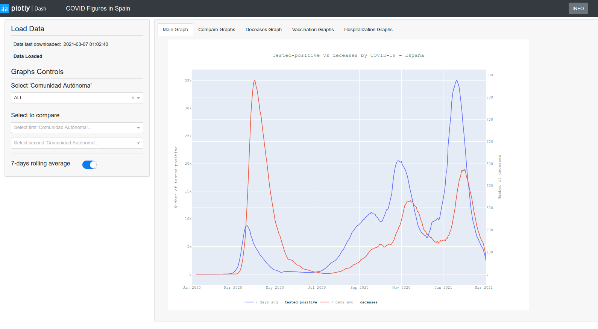
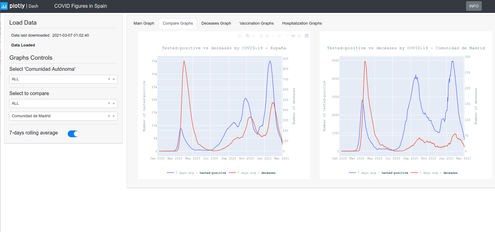
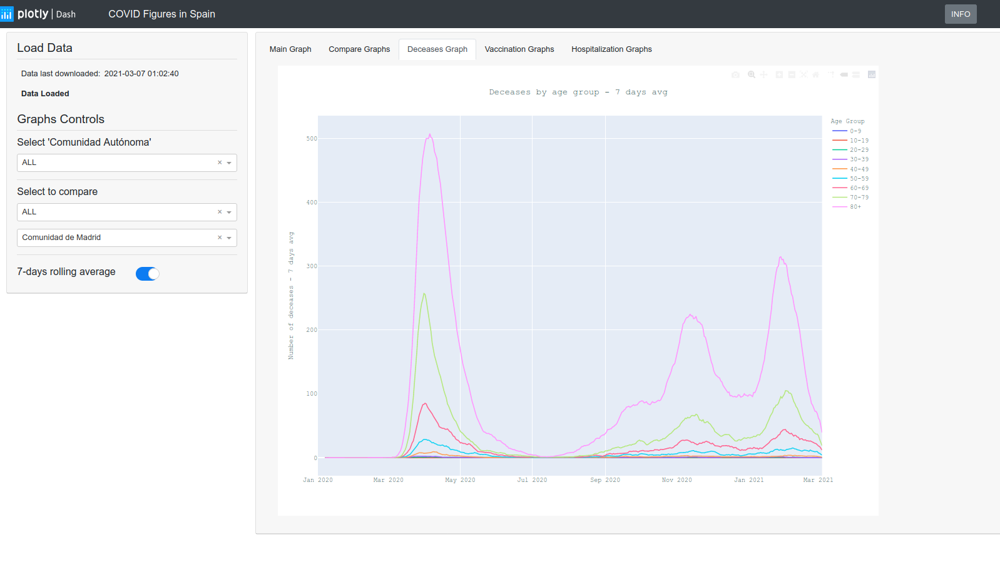
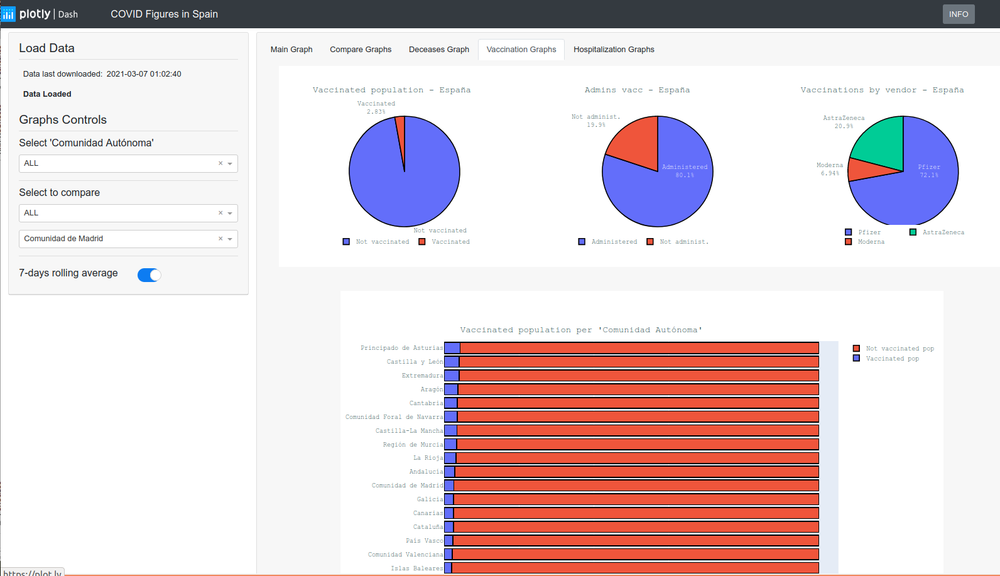

# COVID in Spain Dashboard
> This Dashboard is showing the main figures of COVID pandemic in Spain. This Dashboard has been designed using Plotly Dash in Python 3.6.

## Table of contents
* [General info](#general-info)
* [Screenshots](#screenshots)
* [Technologies](#technologies)
* [Deployed version](#Deployed version)
* [Features](#features)
* [Status](#status)
* [Inspiration](#inspiration)
* [Contact](#contact)

## General info
The purpose of this personal project is double. On one hand, learn how to develop and deploy a basic Dash application using a platform as a service (PaaS) web hosting service, like PythonAnywere. 
On the other, to have a place to check the main figures for the COVID pandemic in Spain.

## Screenshots

## Technologies
The project has been developed using Python 3.6. The main Python libraries in which the project is based are Plotly Dash and Pandas.
* Plotly Dash - version 1.19.0
* Pandas - version 0.24.2

For the rest of used libraries, you can check the requirements.txt file included in the repository.

## Deployed version
You can check the deployed version on my Python Anywhere site: [http://ecefbpi.pythonanywhere.com](http://ecefbpi.pythonanywhere.com)

## Features
List of main features already included:
* Main graph data can be selected by 'Comunidad autónoma'
* Two 'comunidades autónomas' can be compared
* Data can be shown in raw format or as a 7-days rolling average

List of main features to be developed:
* Make it reactive to different screen sizes as well as to different type of devices
* Connect the Dashboard to a database so data is not stored and read from disk

## Status
Project is in progress. I have still a lot to do to enhance the content of the Dashboard as well as the Dashboard itself.

## Inspiration
This project has been inspired by several sources. Regarding Dash development, I've learnt a lot of new things by watching several videos of the Youtube channel [Charming Data](https://www.youtube.com/channel/UCqBFsuAz41sqWcFjZkqmJqQ). Besides, the [Plotly Dash Gallery](https://dash-gallery.plotly.host/Portal/) is also a good place to get inspiration and high quality examples.

## Contact
Created by [Fausto Blasco](https://www.linkedin.com/in/fausto-blasco-9265381/) - feel free to contact me!